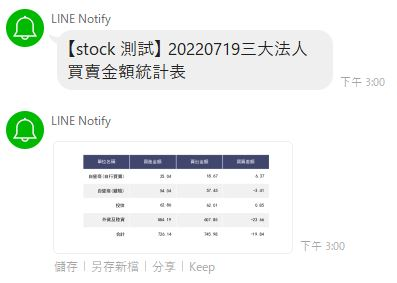
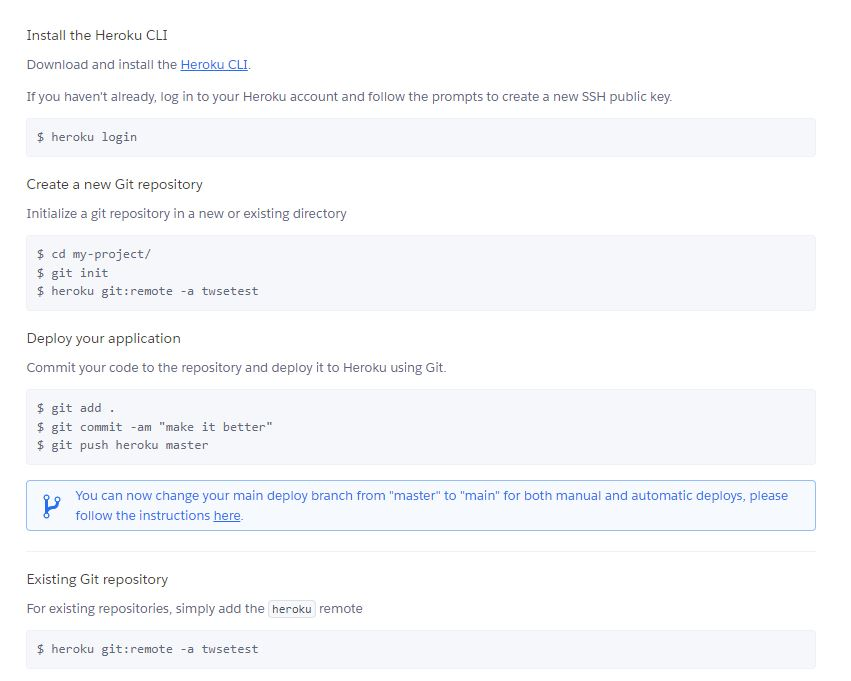
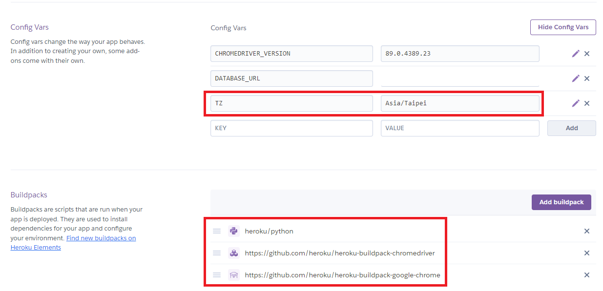

# 成果展示

使用方式:創一個Line群組，把Line notify加入群組，讓他每日3點發通知 



# 環境設置

```
pip install virtualenv
```
選擇好你要的路徑，然後輸入 

```
python3 -m venv venv 

或是

python -m venv venv
```
[虛擬環境參考資料](https://docs.python.org/zh-tw/3/tutorial/venv.html)

環境設定完成後，進入到 \.venv\Scripts 路徑後，輸入 activate，即可啟動虛擬環境

若是使用VScode的可以直接 Crtl +Shift + ~ ，即可開啟。

<br>

# 透過Flask部屬爬蟲，定時傳送資料給Line notify

```
pip install -r requirements
```
首先安裝需求套件，然後編寫app.py 以及 twse.py 

twse.py-> 使用requests 爬取台灣證交所 三大法人買賣金額統計表，並經由pandas整理，並存成.png

app.py -> 使用Flask-APScheduler進行排程，再利用Line notify發布訊息

<br>

# [Line notify權杖token教學](https://ithelp.ithome.com.tw/articles/10276740)
 #拿到token以後，直接複製貼上在 token.txt 裡面。

<br>
# Heroku Server設定

首先下載 [Heroku CLI](https://devcenter.heroku.com/articles/heroku-cli)，安裝完成後，使用下面指令測試，若有顯示版本則成功安裝，繼續下列登入動作
```
heroku --version
```
```
heroku login
```

1. 先在[Heroku](https://www.heroku.com/)網頁上登入，進去後使用右上角"New"創建一個app，接下來會看到下面這個畫面
   


<br>

然後設定好你heroku git 要commit的位置
```
heroku git:remote -a twsetest
```

在 Config Vars 欄位加入 TZ ，Asia/Taipei

然後在 Buildpacks 欄位加入 heroku/python，以及下方兩個網址(為了讓requests 可以爬資料)

https://github.com/heroku/heroku-buildpack-chromedriver

https://github.com/heroku/heroku-buildpack-google-chrome

<br>




1. 確認程式在虛擬環境可以使用，並且要在local端可執行

2. git status #確認你的變動

3. git add . #加入所有變動

4. git commit-m  "First" #提交commit，並說明
   
5. git push Heroku master #push 到heroku 遠端repo，應該也可使用下方這個
```
git push heroku HEAD:master
```
6. heroku run bash (在heroku server上設定、Linux系統)
   

<br>

# 參考資料:

[澎澎 - Flask 網站開發](https://www.youtube.com/watch?v=dYulda6wEWA&t=933s&ab_channel=%E5%BD%AD%E5%BD%AD%E7%9A%84%E8%AA%B2%E7%A8%8B) #重點在runtime.txt、Procfile、.gitignore等基礎設定


[flask_apscheduler 教學](https://www.796t.com/article.php?id=55206) #如何在Flask 使用 flask_apscheduler


[Heroku APScheduler](https://devcenter.heroku.com/articles/clock-processes-python) #重點在於Procfile 怎麼設定


[Flask基礎網站教學](https://hackmd.io/@shaoeChen/SyP4YEnef?type=view) 


[修正圖片顯示字體問題](https://elements.heroku.com/buildpacks/debitoor/heroku-buildpack-converter-fonts)

<br>

# dataframe_image(報錯原因)

若使用 dataframe_image 將 dataframe 存成圖片，Heroku 那邊會報錯 "SyntaxError: not a PNG file"，因此後來不使用dataframe_image。
```
[GCC 9.4.0] on linux
Type "help", "copyright", "credits" or "license" for more information.
>>> import twse
>>> z = twse.get_twse_trade()
[0718/182658.408781:ERROR:headless_shell.cc(209)] Capture screenshot is disabled when remote debugging is enabled.
Traceback (most recent call last):
  File "<stdin>", line 1, in <module>
  File "/app/twse.py", line 57, in get_twse_trade
    dfi.export(StockPrice, './resources/'+todaydate+'.jpg')
  File "/app/.heroku/python/lib/python3.9/site-packages/dataframe_image/_pandas_accessor.py", line 24, in export
    return _export(obj, filename, fontsize, max_rows, max_cols, table_conversion, chrome_path)
  File "/app/.heroku/python/lib/python3.9/site-packages/dataframe_image/_pandas_accessor.py", line 73, in _export
    img_str = converter(html)
  File "/app/.heroku/python/lib/python3.9/site-packages/dataframe_image/_screenshot.py", line 167, in run
    img = self.take_screenshot()
  File "/app/.heroku/python/lib/python3.9/site-packages/dataframe_image/_screenshot.py", line 119, in take_screenshot
    img = mimage.imread(buffer)
  File "/app/.heroku/python/lib/python3.9/site-packages/matplotlib/image.py", line 1560, in imread
    with img_open(fname) as image:
  File "/app/.heroku/python/lib/python3.9/site-packages/PIL/ImageFile.py", line 116, in __init__
    self._open()
  File "/app/.heroku/python/lib/python3.9/site-packages/PIL/PngImagePlugin.py", line 712, in _open
    raise SyntaxError("not a PNG file")
SyntaxError: not a PNG file
```